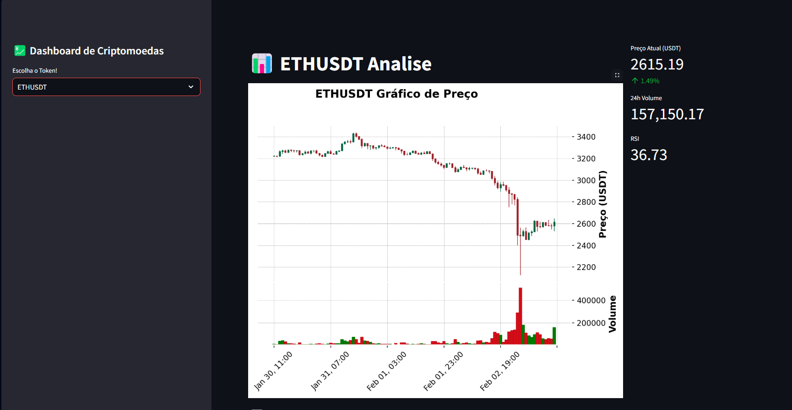

# Dashboard de Análise de Criptoativos

## Descrição
Este projeto é um dashboard automático desenvolvido por um entusiasta do mercado de criptoativos. O objetivo é integrar conhecimento e aprendizado para criar uma ferramenta que permite o acesso gratuito a dados dos tokens BTC, ETH, SOL e BNB, utilizando a API fornecida pela Binance.

## 🖼️ Demonstração Visual
<table align="center">
  <tr>
    <td align="center">
      
      <br>
      <em>Visão Geral do Dashboard</em>
    </td>
    <td align="center">
      
      <br>
      <em>Painel de Análises Técnicas</em>
    </td>
  </tr>
</table>

## Funcionalidades
### Gráficos de Candlestick: Exibição dos gráficos de candles dos tokens selecionados.
## Indicadores Técnicos:
### RSI (Índice de Força Relativa): Indica a força e a velocidade dos movimentos de preço.
### MACD (Convergência e Divergência das Médias Móveis): Auxilia na identificação de tendências de preço.
## Estatísticas Adicionais:
### ATH (All-Time High): Maior valor histórico do token.
### Menor valor recente: Menor preço registrado nos últimos tempos.
### Média de preço: Média dos valores dos últimos 100 candles.
Observação: Todas as análises são baseadas nos últimos 100 candles disponíveis.

Instalação
1- Clone o repositório:

```bash
git clone https://github.com/VictorBelle38/AnaliseCripto.git
cd AnaliseCripto
```

2- Crie e ative um ambiente virtual:

## No Windows (cmd/powershell):
```
python -m venv venv
venv\Scripts\activate
```
## No macOS/Linux (terminal):
```
python3 -m venv venv
source venv/bin/activate
```
3- Instale as dependências: Certifique-se de ter o Python instalado. Em seguida, instale as bibliotecas necessárias:
```
pip install -r requirements.txt
```
4- Execute o dashboard:
```
streamlit run dashboard.py
```

Após rodar esse comando, o Streamlit abrirá automaticamente no navegador, exibindo o dashboard com os gráficos e indicadores.


